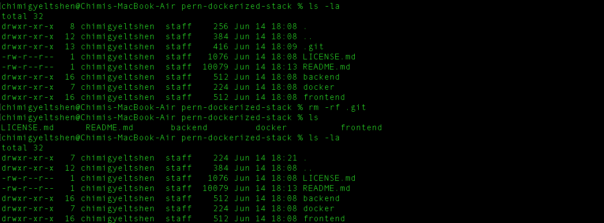

# DSO101: Continuous Integration and Continuous Deployment - Final Project
## Project Overview
This project implements a DevSecOps pipeline for a PERN stack (PostgreSQL, Express, React, Node.js) application using free-tier tools:

- **Jenkins** (for automated GitHub pushes)

- **GitHub Actions** (for Docker builds & pushes)

- **Docker Hub** (for container storage)

- **Render** (for deployment)

The goal is to **automate code synchronization, deployment, and security checks** while adhering to **zero-cost constraints.**

## Repository Setup

1. **Create a GitHub Repository**: Initialized a new repository for assignment. [DSO-FinalAssignment](https://github.com/C-gyeltshen/DSO-FinalAssignment.git)
2. **Clone the Repository**: Cloned the repository to your local machine.

   ```bash
   git clone https://github.com/adefrutoscasado/pern-dockerized-stack.git
   ```
   
3. Remove the existing `.git` directory to start fresh:

   ```bash
   rm -rf .git
   ```
   

4. **Initialize a New Git Repository**: Initialize a new Git repository in the cloned directory.
   ```bash
   git init
   git add .
   git commit -m "Initial commit"
   git remote add origin https://github.com/C-gyeltshen/DSO-FinalAssignment.git
    git branch -M main
    git push -u origin main
   ```
    

## Project Structure
The project is structured as follows:

```
├── backend/
├── docker/
├── frontend/
├── image/
├── LICENSE.md
└── README.md
```
### 1. **backend/**: Contains the Node.js and Express backend code.

   ```bash 
   cd backend
   npm install
   ```
   * Create a `postgres database` in `render.com`.

      

   * Create a `.env` file in the `backend` directory with the following content:

      ```bash
      DATABASE_HOST="your database host"
      DATABASE_PORT="port your db is rinning on"
      DATABASE_USER="your database username"
      DATABASE_PASSWORD="database password"
      DATABASE_NAME="your database name"
      ```

   * Run the backend server:

      ```bash
      npm start
      ```
      


### 2. **frontend/**: Contains the React frontend code.

   ```bash
   cd frontend
   npm install
   ```
   ```bash
   npm start
   ```
   

